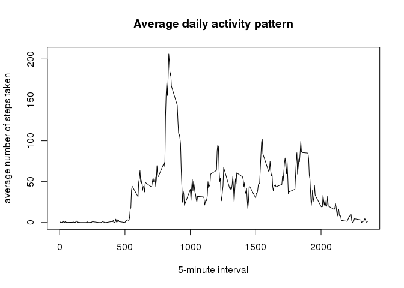
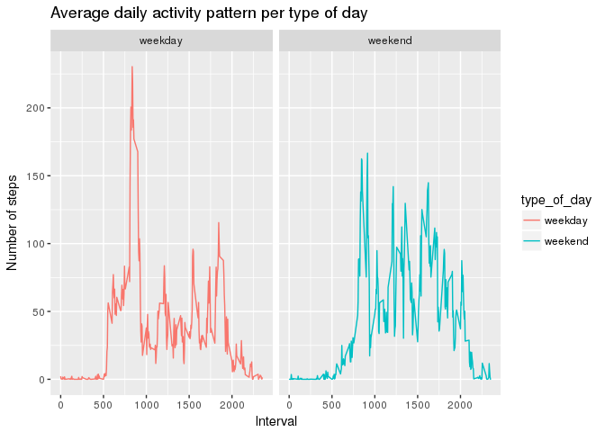

# Reproducible Research: Peer Assessment 1

## Loading libraries

```r
library(dplyr)
```

```
## 
## Attaching package: 'dplyr'
```

```
## The following objects are masked from 'package:stats':
## 
##     filter, lag
```

```
## The following objects are masked from 'package:base':
## 
##     intersect, setdiff, setequal, union
```

```r
library(ggplot2)
```

## Loading and preprocessing the data
Checking if the file activity.zip is unzipped, if it is not, then it is necessary to unzip it.

```r
if (!file.exists('activity.csv')){
    unzip('activity.zip')
}
```

Reading the data, using the colClasses argument to set the 'steps' variable as numeric, the 'date' variable and the 'interval' variable as numeric.

```r
data <- read.csv('activity.csv',
                    header=TRUE, sep=',',
                    colClasses=c('numeric','Date','numeric'))
```
## What is the mean total number of steps taken per day?
Calculating the total number of steps taken per day, ignoring NA's.

```r
total_steps <- data %>%
    filter(!is.na(steps)) %>%
    group_by(date) %>%
    summarize(total_steps_per_day=sum(steps))
```

Plotting the histogram with the total number of steps.

```r
hist(total_steps$total_steps_per_day, breaks=50, main='Histogram of the total number of steps taken each day', xlab='Number of steps per day', ylab='Frequency')
```

<!-- -->

Calculating the mean of total number of setps taken per day

```r
mean_no_na <- mean(total_steps$total_steps_per_day)
print(mean_no_na)
```

```
## [1] 10766.19
```

Calculating the median of total number of setps taken per day

```r
median_no_na <- median(total_steps$total_steps_per_day)
print(median_no_na)
```

```
## [1] 10765
```

## What is the average daily activity pattern?

Plotting  the average number of steps taken for each five minutes

```r
mean_steps_interval <- data %>%
    select(interval, steps) %>%
    group_by(interval) %>%
    summarize(mean_steps=mean(steps,na.rm = TRUE))
plot(x=mean_steps_interval$interval, y=mean_steps_interval$mean_steps, type='l', main='Average daily activity pattern', xlab='5-minute interval', ylab='average number of steps taken')
```

<!-- -->

The 5-minute interval that contains the maximum number of steps, on average, across all days is:

```r
mean_steps_interval %>%
    filter(mean_steps==max(mean_steps)) %>%
    select(interval)
```

```
## # A tibble: 1 × 1
##   interval
##      <dbl>
## 1      835
```

## Imputing missing values

Determining th total number of rows with missing values:

```r
data %>% filter(is.na(steps)) %>% nrow()
```

```
## [1] 2304
```

Filling in all missing values with the mean value for that interval.

```r
no_na_data <- data
no_na_data[match(mean_steps_interval$interval, data$interval) &
         is.na(data$steps), 'steps'] <- mean_steps_interval$mean_steps
```

Plotting an histogram with the total steps taken each day for the new dataset withou NA

```r
no_na_total_steps <- no_na_data %>%
    group_by(date) %>%
    summarize(total_steps=sum(steps))
```

Plotting an histogram with the total number of steps taken each day.

```r
hist(no_na_total_steps$total_steps, breaks=50, main='Histogram of the total number of steps taken each day', xlab='Daily total number of steps', ylab='Frequency')
```

<!-- -->

Calculating the mean of total number of steps taken per day

```r
mean(no_na_total_steps$total_steps)
```

```
## [1] 10766.19
```

Calculating the median of total number of steps taken per day

```r
median(no_na_total_steps$total_steps)
```

```
## [1] 10766.19
```

Checking if there is any difference on the mean of total number of steps taken per day

```r
if (mean(no_na_total_steps$total_steps) != mean(total_steps$total_steps_per_day)) {
    print('The absolute difference on the mean is:')
    print(mean(no_na_total_steps$total_steps) - mean(total_steps$total_steps_per_day))
    print('The percentual change is:')
    print(abs(mean(no_na_total_steps$total_steps) - mean(total_steps$total_steps_per_day))*100/
        mean(total_steps$total_steps_per_day))
}else{
  print('There was no difference.')
  }
```

```
## [1] "There was no difference."
```

Checking if there is any difference on the median of total number of steps taken per day

```r
if (median(no_na_total_steps$total_steps) != median(total_steps$total_steps_per_day)) {
    print('The absolute difference on the median is:')
    print(median(no_na_total_steps$total_steps) - median(total_steps$total_steps_per_day))
    print('The percentual change is:')
    print(abs(median(no_na_total_steps$total_steps) - median(total_steps$total_steps_per_day))*100/
        median(total_steps$total_steps_per_day))
}else{
  print('There was no difference.')
  }
```

```
## [1] "The absolute difference on the median is:"
## [1] 1.188679
## [1] "The percentual change is:"
## [1] 0.01104207
```

## Are there differences in activity patterns between weekdays and weekends?

Creating factor variables for weekdays and weekend:

```r
no_na_data <- no_na_data %>%
                mutate(day_of_the_week=weekdays(date)) %>%
                mutate(type_of_day=ifelse(
                    day_of_the_week %in% c('sábado','domingo'),
                    'weekend',
                    'weekday')) %>%
                mutate(type_of_day=as.factor(type_of_day))
```

Plotting the 5-minute interval (x-axis) and the average number of steps taken:

```r
mean_steps <- no_na_data %>%
    select(interval, steps, type_of_day) %>%
    group_by(type_of_day, interval) %>%
    summarize(mean_steps=mean(steps))

ggplot(mean_steps, aes(x=interval, y=mean_steps)) +
    geom_line(aes(colour=type_of_day), stat="identity") +
    facet_wrap(~type_of_day) +
    labs(title='Average daily activity pattern per type of day', x='Interval', y='Number of steps')
```

<!-- -->
